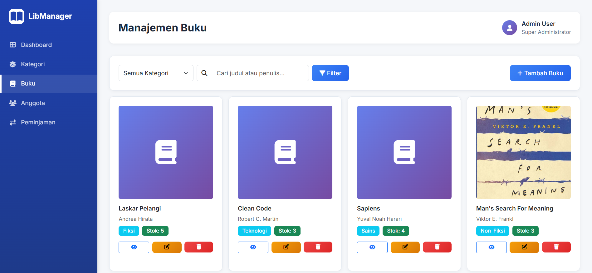
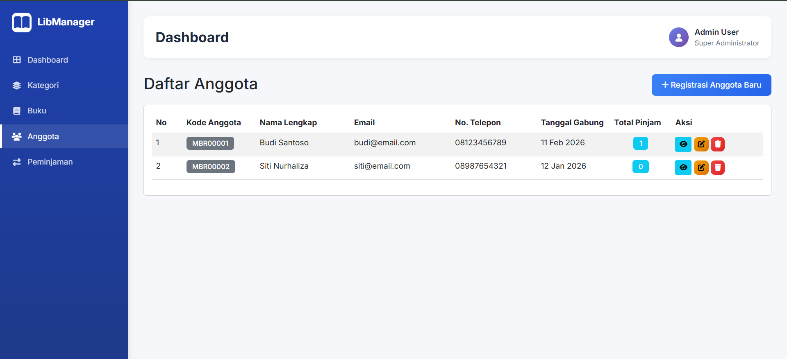
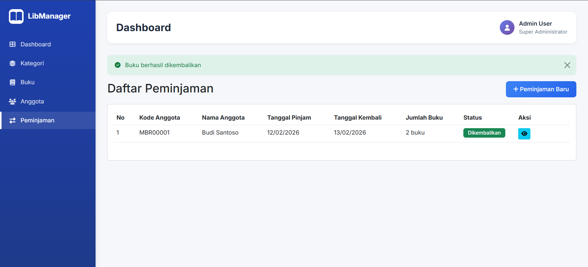
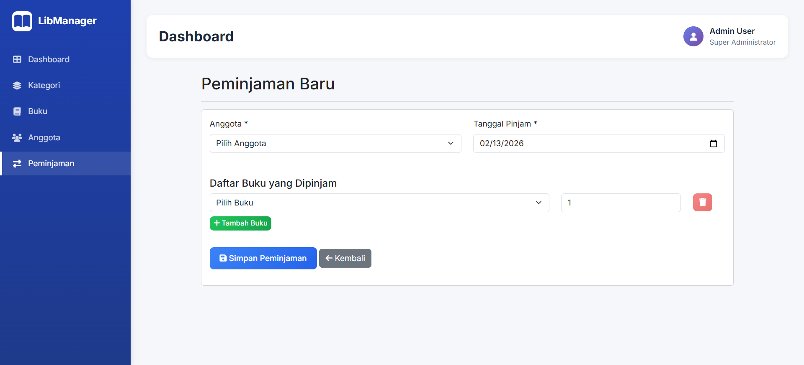

# Sistem Manajemen Perpustakaan

## 📚 Informasi Pribadi

- **Nama    :** Kiyo Vincent Adhi Kusalo Hartono
- **NIM     :** 2902574990
- **Jurusan :** Computer Science

---

## 📖 Deskripsi Project

Sistem Manajemen Perpustakaan berbasis web menggunakan **Laravel 11** untuk mengelola data buku, kategori, anggota, dan transaksi peminjaman. Project ini dibuat sebagai **Mid Project** untuk mata kuliah **Back-End Development - BNCC**.

---

## ✨ Fitur Utama

- ✅ **Dashboard** - Statistik real-time (total buku, anggota, peminjaman aktif)
- ✅ **CRUD Kategori Buku** - Kelola kategori dengan validasi
- ✅ **CRUD Buku** - Upload cover image, filter by kategori, search
- ✅ **CRUD Anggota** - Auto-generate kode anggota (MBR00001, MBR00002, ...)
- ✅ **Manajemen Peminjaman** - Peminjaman multi-buku dalam 1 transaksi
- ✅ **Pengembalian Buku** - Update stok otomatis
- ✅ **Filter & Search** - Pencarian buku berdasarkan judul/penulis
- ✅ **Validasi Form** - Server-side validation untuk semua form
- ✅ **Relational Database** - One-to-Many, Many-to-Many relationships

---

## 🛠️ Teknologi

- **Framework:** Laravel 11
- **Database:** MySQL
- **Frontend:** Bootstrap 5
- **PHP Version:** 8.2+
- **Node.js:** 18+

---

## 📦 Cara Instalasi

### Prasyarat
- PHP 8.2+
- Composer
- MySQL/MariaDB
- Node.js 18+
- Git

### 1️⃣ Clone Repository
```bash
git clone https://github.com/Kiyo21-deym/Kiyo-Vincent-Adhi-Kusalo-Hartono_BE_Mid-Project.git
cd Kiyo-Vincent-Adhi-Kusalo-Hartono_BE_Mid-Project
```

### 2️⃣ Install Dependencies
```bash
composer install
npm install
```

### 3️⃣ Setup Environment
```bash
cp .env.example .env
php artisan key:generate
```

### 4️⃣ Konfigurasi Database

Edit file `.env`:
```env
DB_DATABASE=librarymanager
DB_USERNAME=root
DB_PASSWORD=
```

Buat database di MySQL:
```sql
CREATE DATABASE librarymanager;
```

### 5️⃣ Migrasi & Seeder
```bash
php artisan migrate --seed
```

*Perintah ini akan membuat tabel database dan mengisi data dummy untuk testing.*

### 6️⃣ Link Storage
```bash
php artisan storage:link
```

*Membuat symbolic link agar file upload (cover buku) bisa diakses.*

### 7️⃣ Compile Assets
```bash
npm run build
```

### 8️⃣ Jalankan Server
```bash
php artisan serve
```

Akses aplikasi di: **http://localhost:8000**

**Catatan:** Aplikasi akan langsung terbuka ke Dashboard.

---

## 🗄️ Database Schema

### **Entity Relationship:**
```
categories (1) ──< (M) books
members (1) ──< (M) borrowings
borrowings (1) ──< (M) borrowing_details
books (1) ──< (M) borrowing_details
```

### **Tables:**

#### 1. categories
```sql
- id (PK)
- name (VARCHAR)
- description (TEXT, nullable)
- timestamps
```

#### 2. books
```sql
- id (PK)
- category_id (FK → categories)
- title (VARCHAR)
- author (VARCHAR)
- isbn (VARCHAR, unique)
- publisher (VARCHAR)
- publication_year (YEAR)
- stock (INTEGER, default: 0)
- cover_image (VARCHAR, nullable)
- description (TEXT, nullable)
- timestamps
```

#### 3. members
```sql
- id (PK)
- member_code (VARCHAR, unique)
- name (VARCHAR)
- email (VARCHAR, unique)
- phone (VARCHAR)
- address (TEXT, nullable)
- join_date (DATE)
- timestamps
```

#### 4. borrowings
```sql
- id (PK)
- member_id (FK → members)
- borrow_date (DATE)
- return_date (DATE, nullable)
- status (ENUM: 'borrowed', 'returned')
- timestamps
```

#### 5. borrowing_details
```sql
- id (PK)
- borrowing_id (FK → borrowings)
- book_id (FK → books)
- quantity (INTEGER, default: 1)
- timestamps
```

---

## 📸 Screenshot Aplikasi

### Dashboard

*Dashboard menampilkan statistik real-time*

### Kategori

*Categories menampilkan daftar kategori buku*

### Buku

*Manajemen buku dengan filter dan search*

### Anggota

*Manajemen anggota dengan auto-generated code*

### Peminjaman

*Peminjaman menampilkan daftar peminjaman*

### Form Peminjaman

*Form peminjaman multi-buku*

---

## 🚀 Fitur Unggulan

1. **Auto-Generate Member Code**  
   Kode anggota otomatis dibuat dengan format MBR00001, MBR00002, dst.

2. **Multi-Book Borrowing**  
   Satu transaksi peminjaman bisa meminjam banyak buku sekaligus.

3. **Real-time Stock Update**  
   Stok buku otomatis berkurang saat dipinjam dan bertambah saat dikembalikan.

4. **Modern UI**  
   Tampilan modern dengan sidebar navigation, gradient colors, dan card statistics.

5. **Form Validation**  
   Validasi server-side untuk semua form input.

---

## 🔐 Security Features

- ✅ CSRF Protection (semua form POST/PUT/DELETE)
- ✅ SQL Injection Prevention (Eloquent ORM)
- ✅ Input Validation (server-side)
- ✅ Mass Assignment Protection (`$fillable`)
- ✅ Foreign Key Constraints

---

## 📚 Struktur Project
```
app/
├── Http/Controllers/
│   ├── CategoryController.php
│   ├── BookController.php
│   ├── MemberController.php
│   ├── BorrowingController.php
│   └── DashboardController.php
├── Models/
│   ├── Category.php
│   ├── Book.php
│   ├── Member.php
│   ├── Borrowing.php
│   └── BorrowingDetail.php

database/
├── migrations/
│   ├── create_categories_table.php
│   ├── create_books_table.php
│   ├── create_members_table.php
│   ├── create_borrowings_table.php
│   └── create_borrowing_details_table.php
└── seeders/
    ├── CategorySeeder.php
    ├── BookSeeder.php
    └── MemberSeeder.php

resources/views/
├── layouts/
│   └── app.blade.php
├── dashboard.blade.php
├── categories/
│   ├── index.blade.php
│   ├── create.blade.php
│   ├── edit.blade.php
│   └── show.blade.php
├── books/
│   ├── index.blade.php
│   ├── create.blade.php
│   ├── edit.blade.php
│   └── show.blade.php
├── members/
│   ├── index.blade.php
│   ├── create.blade.php
│   ├── edit.blade.php
│   └── show.blade.php
└── borrowings/
    ├── index.blade.php
    ├── create.blade.php
    └── show.blade.php
```

---

## 🔮 Future Improvements

- [ ] Role-based access control (Admin, Librarian)
- [ ] Email notification untuk reminder
- [ ] Barcode scanner untuk ISBN
- [ ] Export report to PDF/Excel
- [ ] Fitur reservasi buku
- [ ] Dashboard analytics dengan chart

---

## 📞 Contact

**Developer:**
- **Nama:** Kiyo Vincent Adhi Kusalo Hartono
- **NIM:** 2902574990
- **Program:** Computer Science - BINUS University
- **Email:** [kiyo.hartono@binus.ac.id]
- **GitHub:** [@Kiyo21-deym](https://github.com/Kiyo21-deym)

---

## 🙏 Acknowledgments

- **BNCC** - Bina Nusantara Computer Club
- **Laravel Documentation** - https://laravel.com/docs
- **Bootstrap** - https://getbootstrap.com

---

**🎓 BNCC - Back-End Development Mid Project 2026**

**#VIVABNCC** 🚀

---

*Last Updated: February 11, 2026*
